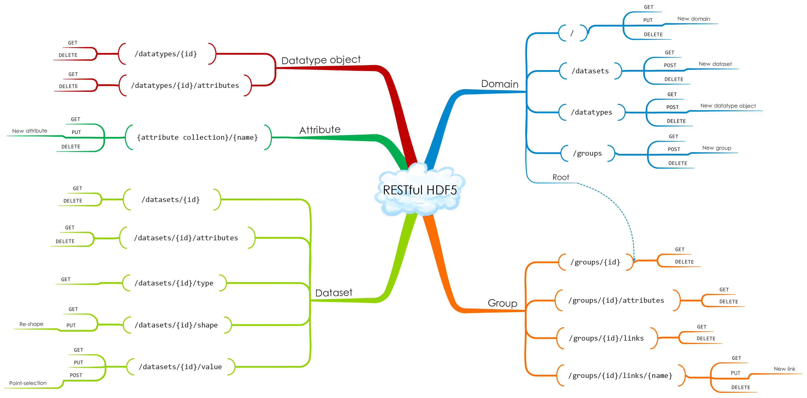

# HDF REST API

The HDF REST API is an interface to HDF5 data stored on network-based architectures. The HDF REST API has provisions to support CRUD (create, read, update and delete) operations on the full spectrum of HDF5 objects including: groups, links, datasets, attributes, and committed data types. See <https://support.hdfgroup.org/pubs/papers/RESTful_HDF5.pdf> for background on the design principles that guided the development of the RESTful HDF5 interface.

This repository provides documentation on what operations are supported by the HDF REST API and some guidelines as to how to effectively use these. 

As a REST-based API, different servers can be developed that support the HDF REST API. Some services which have implemented the HDF REST API are:

* HDF Kita: <https://www.hdfgroup.org/hdf-kita>
* HSDS:  <https://github.com/HDFGroup/hsds>
* H5serv: <https://github.com/HDFGroup/h5serv>

Not all implementations support all the REST operations documented here.  When a specific operation is not supported in one of the above implementations, it will be noted.

There are also various packages and libraries that utilize the REST API as a client.  These include:

* Python SDK - h5pyd:  <https://github.com/HDFGroup/h5pyd>
* C/Fortran  HDF5 REST VOL: <https://bitbucket.hdfgroup.org/users/jhenderson/repos/rest-vol/browse>
* R SDK - restfulSE: <https://github.com/vjcitn/restfulSE>

The following diagram illustrates the various resources and operations of the HDF REST API:

